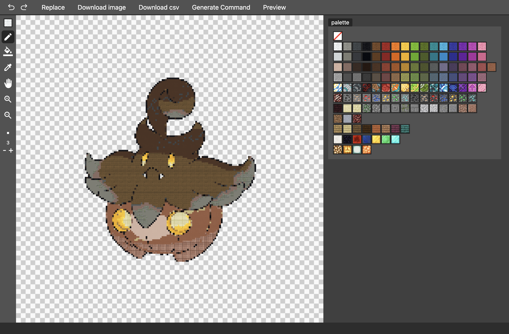

# Minecraft Dot

Minecraft Dot is a minecraft pixel art generator.

You can convert image to minecraft pixel art.
After converting, you can edit pixel art in editor.

This app support minecraft command.
You can generate pixel art in your Minecraft by executing command.

[Website](https://minecraft-dot.pictures/)

